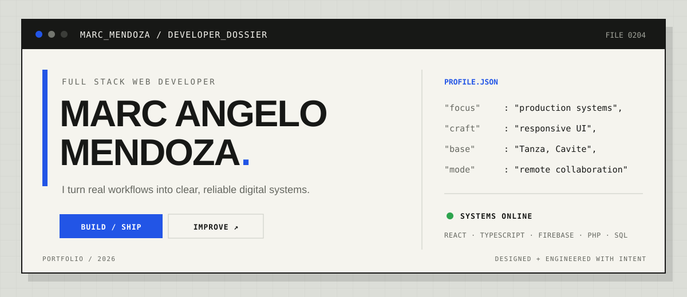
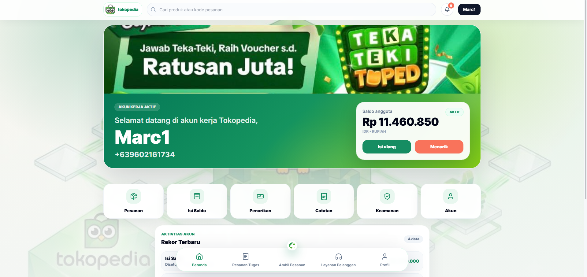
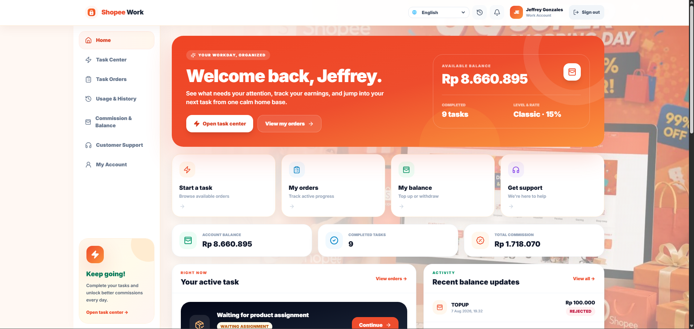
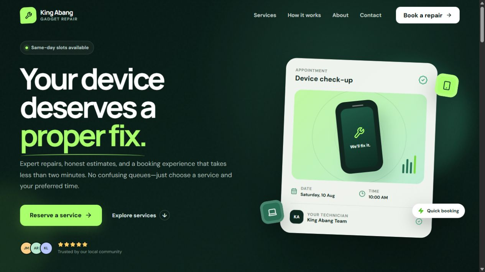
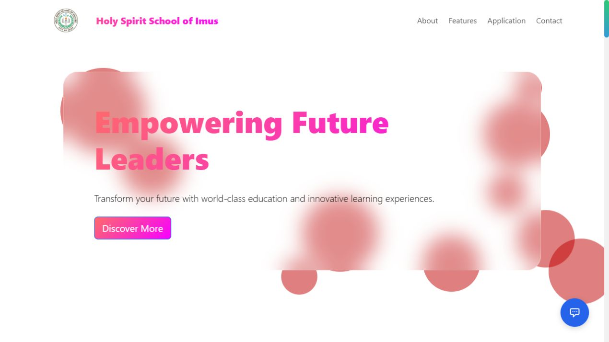
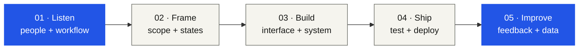

<div align="center">



<p>
  <a href="https://portfolio-marc-mendoza.onrender.com"><strong>LIVE PORTFOLIO ↗</strong></a>
  &nbsp;&nbsp;·&nbsp;&nbsp;
  <a href="mailto:mendoza.marcangelo28@gmail.com"><strong>START A CONVERSATION</strong></a>
  &nbsp;&nbsp;·&nbsp;&nbsp;
  <a href="./public/Marc-Angelo-Mendoza-CV.pdf"><strong>READ THE CV</strong></a>
</p>

<sub>FULL STACK DEVELOPMENT&nbsp;&nbsp; / &nbsp;&nbsp;PRODUCT INTERFACES&nbsp;&nbsp; / &nbsp;&nbsp;OPERATIONAL SYSTEMS</sub>

</div>

<br>

<a id="operating-mode"></a>

## `01 /` Operating mode

> I build at the point where people, interfaces, and business workflows meet.

I’m **Marc**, a full stack developer from Tanza, Cavite. I turn complicated processes into software that feels clear to use and dependable to run—from the public-facing screen to the admin tools and data underneath it.

<table>
  <tr>
    <td width="33%" valign="top">
      <strong>◼ UNDERSTAND</strong><br><br>
      Map the real workflow, users, edge cases, and definition of success.
    </td>
    <td width="33%" valign="top">
      <strong>◼ ENGINEER</strong><br><br>
      Shape responsive interfaces, secure data flows, and maintainable systems.
    </td>
    <td width="33%" valign="top">
      <strong>◼ DELIVER</strong><br><br>
      Deploy, document, hand over, measure, and keep improving what ships.
    </td>
  </tr>
</table>

```text
current.signal
├── building      production platforms for real client operations
├── strongest_at  React · TypeScript · Firebase · responsive UI
├── also_speaks   PHP · SQL · Python · Java · C# · C++
└── cares_about   clarity · reliability · customer empathy
```

<a id="proof-of-work"></a>

## `02 /` Proof of work

Not concept shots—live products made for real workflows. Select a frame to open the project.

<table>
  <tr>
    <td width="50%" valign="top">
      <a href="https://skilltestindonesia.com/">
        
      </a>
      <h3>01 — SkillTest Indonesia ↗</h3>
      <p>A production business platform with customer, admin, and super-admin portals, built across frontend, Firebase services, deployment, and handover.</p>
      <code>React</code> <code>TypeScript</code> <code>Firebase</code>
    </td>
    <td width="50%" valign="top">
      <a href="https://mitratestindonesia.com/login">
        
      </a>
      <h3>02 — Mitra Test Indonesia ↗</h3>
      <p>A secure authentication and task-management entry point delivered for real operational use by an Indonesian client.</p>
      <code>Authentication</code> <code>Database</code> <code>Production</code>
    </td>
  </tr>
  <tr>
    <td width="50%" valign="top">
      <a href="https://kingstore-kry3.onrender.com/">
        
      </a>
      <h3>03 — King Abang Gadget Repair ↗</h3>
      <p>A responsive service and reservation experience designed to make device repair feel transparent and easy to book.</p>
      <code>TypeScript</code> <code>Booking</code> <code>Responsive UI</code>
    </td>
    <td width="50%" valign="top">
      <a href="https://hshr.onrender.com/landing_page">
        
      </a>
      <h3>04 — Holy Spirit School of Imus ↗</h3>
      <p>A school-facing web experience and ERP-style project developed with a practical, operations-first approach.</p>
      <code>PHP</code> <code>MySQL</code> <code>Team Lead</code>
    </td>
  </tr>
</table>

<p align="right">
  <a href="https://portfolio-marc-mendoza.onrender.com/#work"><strong>EXPLORE ALL 8 PROJECTS →</strong></a>
</p>

<a id="system-map"></a>

## `03 /` How I move a project



The process is deliberately small: understand the operation, reduce ambiguity, build the right surface and system, then stay close enough to improve it.

<a id="toolbox"></a>

## `04 /` Toolbox, organized by job

| When the job is… | I reach for… |
| --- | --- |
| **Interface engineering** | `React` `TypeScript` `JavaScript` `HTML` `CSS` `Tailwind` `Bootstrap` `Vite` |
| **Backend & data** | `PHP` `Firebase` `PostgreSQL` `Supabase` `MySQL` `SQL` |
| **General programming** | `Python` `Java` `C#` `C++` |
| **Shipping & collaboration** | `Git` `GitHub` `ClickUp` `GoHighLevel` |
| **AI-assisted workflow** | `ChatGPT` `Codex` `Gemini` `Claude` |

<a id="repository"></a>

## `05 /` Inside this repository

This is the source for my one-page portfolio: a warm-paper developer dossier built with **React 19, TypeScript, Vite, Tailwind CSS 4, Motion, and Lucide React**.

```bash
git clone https://github.com/Necko0204/portfolioMarc2.git
cd portfolioMarc2
npm install
npm run dev
```

<details>
<summary><strong>Open the project map</strong></summary>

```text
src/
├── components/   reusable interface and portfolio modules
├── data/         profile, experience, projects, and skills
├── hooks/        scroll-aware navigation behavior
├── sections/     one-page portfolio sections
├── App.tsx       page composition
└── App.css       visual system and responsive layouts
```

Most portfolio content lives in [`src/data/portfolio.ts`](src/data/portfolio.ts). Project presentation lives in [`src/components/ProjectIndex.tsx`](src/components/ProjectIndex.tsx).

</details>

<br>

<div align="center">

### Have a messy workflow that deserves a clean system?

[**mendoza.marcangelo28@gmail.com**](mailto:mendoza.marcangelo28@gmail.com)

<sub>DESIGNED + ENGINEERED BY MARC ANGELO MENDOZA · 2026</sub>

</div>
